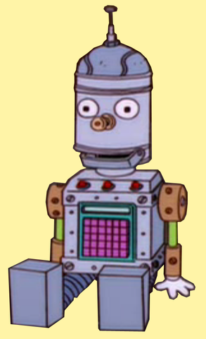
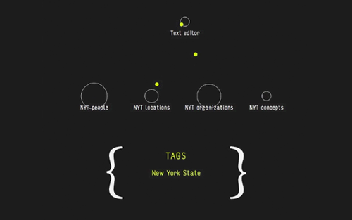

# linguo

</img>
 
[Image url](http://simpsons.wikia.com/wiki/File:LinguoInfo.png)
 
## Motivation
This work was done as part of The New York Times R&D([nytlabs](http://nytlabs.com/)) internship in July, 2014.
The result was [<i>Editor</i>](http://nytlabs.com/projects/editor.html).
 
><i>Editor is an experimental text editing interface that explores how collaboration between machine learning systems and journalists could afford fine-grained annotation and tagging of news articles. Our approach applies machine learning techniques interactively, as part of the writing process, rather than retroactively. This approach can offload the burden of work to the computational processes, and can create affordances for journalists to augment, edit and correct those processes with their knowledge.</i>

You can view it in use [here](http://nytlabs.com/projects/editor.html):
 

## Repository Description
<b><i>linguo</i></b> is a set of [microservices](https://en.wikipedia.org/wiki/Microservices) that provide Natural Language Processing abilities for text editors.  

<b>Note</b>: Most of the problems have been well researched since 2014, so there are better libraries available to perform the same task. The libraries like [goose](https://github.com/grangier/python-goose) and [reporter](https://pypi.python.org/pypi/reporter/0.1.2) are some of the other libraries.

<i>Editor</i> used following microservices.

1. [times_tagger](./times_tagger/) : This folder contains scripts to tag articles with tags from the Times. More information is inside the folder.

2. [sentence_segmentation](./sentence_segmentation/) : Scripts in this folder implements a web service to identify sentences from a body of text.

3. [keyword_extraction](./Keyword_extraction/) : Scripts in this folder are aimed at extraction of keywords from urls.

4. [text_classifier](./text_classifier/) : It is an attempt to classify articles into labels as given in Times taxonomy. Multi-Label Classification is done by using Google's [Word2Vec](https://en.wikipedia.org/wiki/Word2vec) representation of word as 100 dimensional vectors.

As part of another experiment to find the topics of discussion in the lab, I implemented <i>Topic Tracker</i> which performs LDA on the content extracted from different URLs being visited.
1. [topic_tracker](./Topic_Tracker/) : It is an attempt to summarize topics that are being read by an individual or a group of people.

2. [ html_text_extractor](./html_text_extractor) : Given an url, it contains massive amount of text but not all text contains core information (about which the page is). This is an attempt to build a classifier on p tags in html to classify if its good or bad.

- [usefulScripts](./usefulScripts/) : It contains all the scripts which were helpful in preprocessing articles, querying mongoDB or experimenting with LDA.

[app.py](./app.py) script combines all the services.
